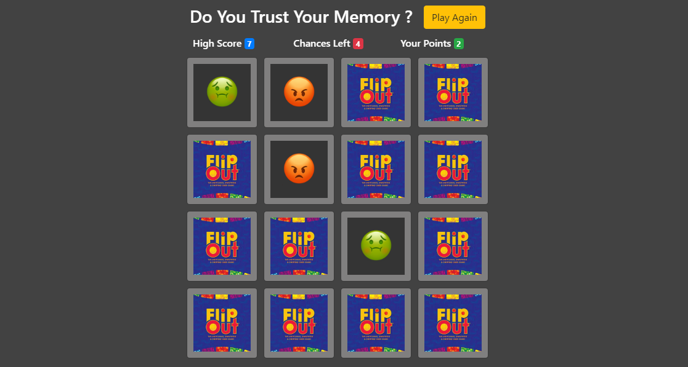

## JS-Card-Flip-Game
Card flipping game to test your memory.

Features (rules) of game :
* You get 10 chances to match a card.
* If the flipped pair does not match, you lose a Chance. If they match, Well you earn yourself a point. :smile:

Flip the Card to test your memory game made using **JavaScript**. Compatible on desktop browsers (recommended).

### Usage
* Please [check this link](https://card-flip-game-by-vishal.netlify.app/). The project is deployed on Netlify.
* If you want to run on your machine : Download the project and run "index.html" straight away !!

Special Thanks to [Hitesh Choudhary](https://github.com/hiteshchoudhary) for helping me learn JavaScript.
